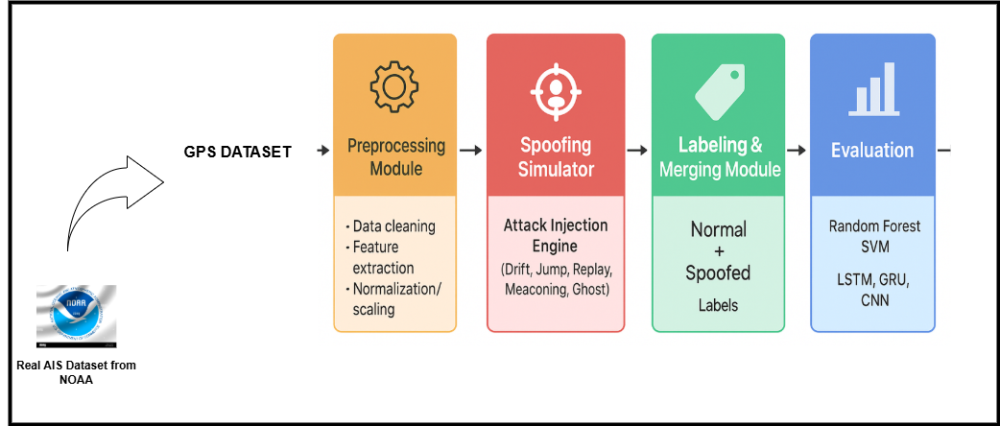

# AI Detection Response for GPS Spoofing on Maritime Autonomous Surface Ships 🚢 

## Project Overview
This project focuses on detecting GPS spoofing attacks on maritime autonomous surface ships using AI. The goal is to develop a modular simulation framework capable of generating GPS spoofing scenarios, preprocessing AIS datasets, and applying detection algorithms to identify abnormal behaviors. The framework integrates datasets, simulation, and detection in a pipeline for testing and evaluation purposes.

---

## System Architecture
The system is designed as a modular pipeline, where each component performs a specific function:

1. **Input Layer**  
   Provides the foundational data for simulation. It includes:
   - AIS dataset containing real-world vessel information
   - Simulation configuration defining parameters for spoofing scenarios

2. **Processing Layer**  
   Responsible for preprocessing data, feature engineering, and preparing the dataset for simulation.

3. **Simulation Engine**  
   Generates spoofed GPS signals based on the input data and defined attack patterns.

4. **Detection Module**  
   Implements AI algorithms to analyze the simulated data and detect anomalies or spoofing attempts.

### Architecture Diagram

---

## Simulator Environment
The simulator is organized as a modular pipeline to provide flexibility and scalability. Each stage is independent and can be configured, extended, or replaced:

- **Data Input:** Handles real AIS data ingestion  
- **Spoofing Generator:** Simulates GPS anomalies for testing  
- **Feature Extractor:** Prepares features for detection algorithms  
- **Detection Engine:** Applies AI models to classify normal vs spoofed signals  

### Simulator Pipeline Diagram
.

---

## Threat Modeling
To ensure system resilience, a **threat modeling study** was conducted following the STRIDE methodology. The analysis highlights how different GPS spoofing attacks exploit vulnerabilities and the mitigations adopted in the system.

### STRIDE Threat Table

### Threat Model Diagram
A high-level GPS threat model for MASS navigation illustrates the relationship between **adversaries, attack vectors, vulnerabilities, and impacts**.

---

## Project Folder Structure
dataset/ → AIS datasets and extracted GPS datasets
notebook/ → Jupyter notebooks for analysis, testing, and simulation
images/ → Architecture, pipeline, and threat model diagrams
results/ → Outputs from simulations and detection 
